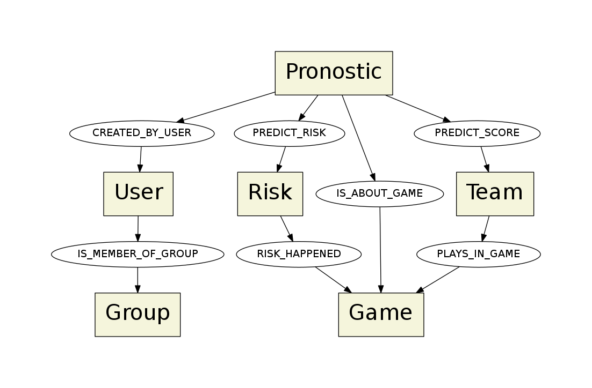

= Data design

The database used is http://neo4j.com/[Neo4j].

== Nodes and relationships links

== Nodes and relationships properties

=== User

|===
| createdAt        | date
| updatedAt        | date
| uuid             | string
| name             | string
| email            | string
| avatar_url       | string
| lastConnectionAt | date
|===

=== Group

|===
| createdAt        | date
| updatedAt        | date
| uuid             | string
| name             | string
| avatar_url       | string
|===

=== Pronostic

|===
| createdAt        | date
| updatedAt        | date
| uuid             | string
|===

=== Risk

|===
| createdAt        | date
| updatedAt        | date
| uuid             | string
| text             | string
|===

=== Game

|===
| createdAt        | date
| updatedAt        | date
| uuid             | string
| phase            | string
| startsAt         | date
| stadium          | string
| city             | string
|===

=== Team

|===
| createdAt        | date
| updatedAt        | date
| uuid             | string
| countryName      | string
| countryCode      | string
|===

=== IS_MEMBER_OF_GROUP

|===
| createdAt        | date
| updatedAt        | date
| isAdmin          | boolean
| isActive         | boolean
|===

=== CREATED_BY_USER

|===
| createdAt        | date
| updatedAt        | date
| classicPoints    | number
| riskPoints       | number
|===

=== PREDICT_RISK

|===
| createdAt        | date
| updatedAt        | date
| willHappen       | boolean
| amount           | number
|===

=== USED_FOR_GAME

|===
| createdAt        | date
| updatedAt        | date
| happened         | boolean
|===

=== IS_ABOUT_GAME

|===
| _no properties_
|===

=== PREDICT_SCORE

|===
| createdAt        | date
| updatedAt        | date
| score            | number
|===

=== PLAYS_IN_GAME

|===
| createdAt        | date
| updatedAt        | date
| order            | number
| score            | number
| penalties        | number
|===